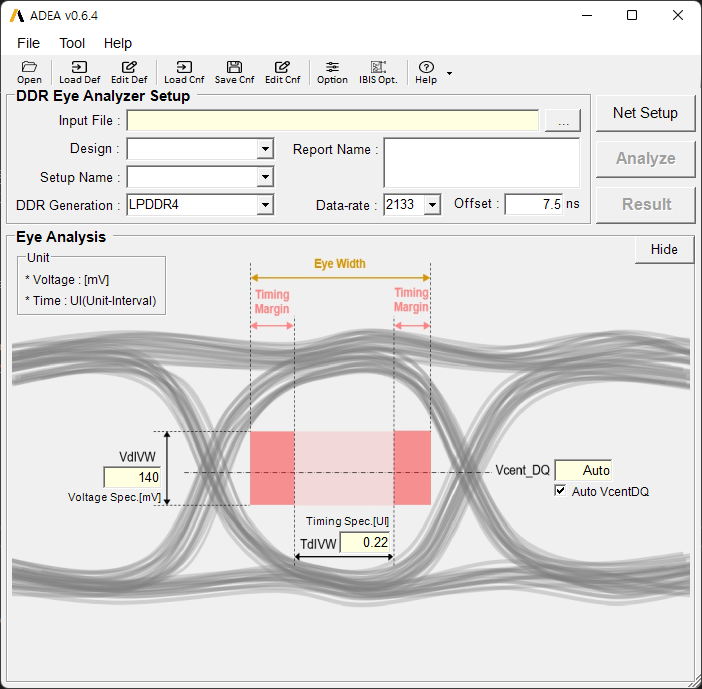

<h1><b>A</b>nsys
    <b>D</b>DR
    <b>E</b>ye
    <b>A</b>nalyzer - 
    <b>ADEA</b>  </h1>

<!--  -->
## Introduction
---
## What is ADEA?
---
## Why ADEA?
---
## Documentations
---
## User Guide
---
## Development Request
---
## History
> ### [v0.5.1] - '22.08.06
    >>- ##### Eye 계측 Algorithm Classic Version(VB) 으로 변경 후, Excel report 생성 bug 수정
    >>- ##### Resource 폴더 정리
    >>- ##### 예제 Archive file 추가
    >>- ##### CSV input disable

> ### [v0.5.2] - '22.08.07
    >>- ##### Excel report format 변경
    >>- ##### Jitter, Jitter_RMS 열 삭제
    >>- ##### Width & Margin UI 단위 열 추가

> ### [v0.5.3] - '22.08.08
    >>- ##### IBIS bug fix    
    >>- ##### Show result window for each IBIS cases

> ### [v0.6] - '22.08.09
    >>- ##### Release to SEC

> ### [v0.6.1] - '22.08.12
    >>- ##### Modify IBIS Optimization example (buffer -> pin import)
    >>- ##### Bug fix for IBIS New & pin import case

> ### [v0.6.2] - '22.08.24
    >>- ##### IBIS Model check시 sim case 바로 반영되지 않던 문제 수정
    >>- ##### IBIS Model refresh button click시 sim case 초기화 되지 않던 문제 수정
    >>- ##### IBIS Run Click시 초기화 문제 수정
    >>- ##### Tx/Rx 같은 *.ibs file 사용 Case update
    >>- ##### IBIS form resize event update
    >>- ##### Automatic data-rate detect algorithm are updated

> ### [v0.6.3] - '22.08.30
    >>- ##### 이전 IBIS 형식으로 작성된 Schematic에서도 IBIS opt. 동작하도록 update.
    >>- ##### 이전 IBIS 형식의 예제 Schematic update (LPDDR4_2133_IBIS_Example_for_Old_IBIS.aedtz)

> ### [v0.6.4] - '22.09.01
    >>- ##### 예제 Archive file 재정비
    >>- ##### 자동 Datarate 입력 기능 Disable
    >>- ##### QC Routine 및 QC 결과표 작성

