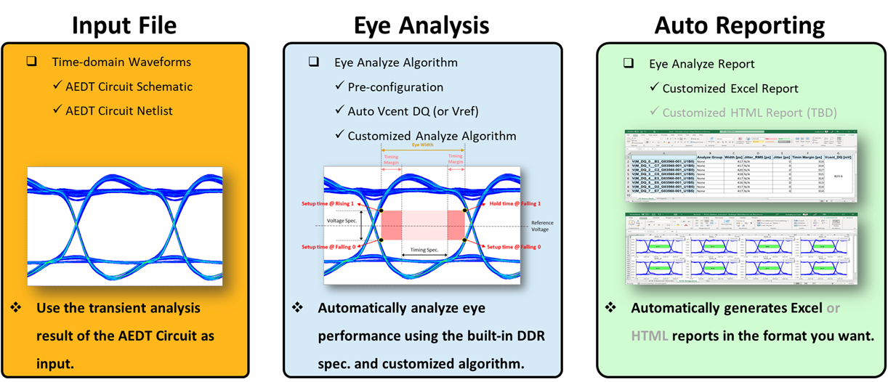
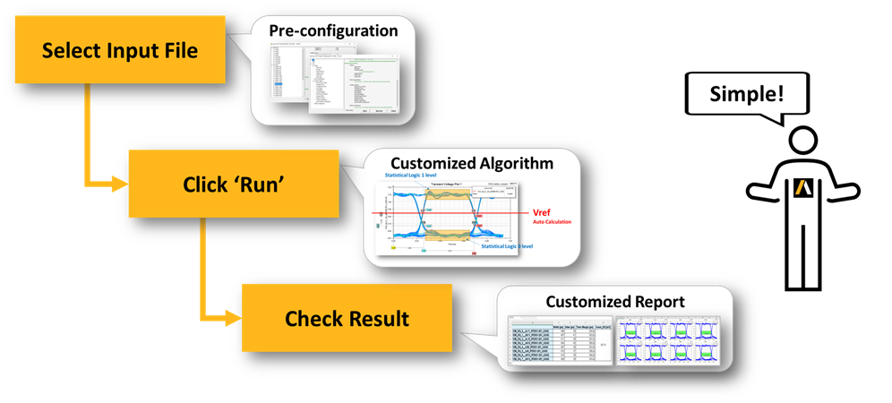
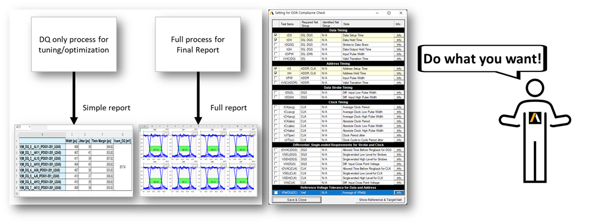

# Ansys DDR Eye Analyzer - ADEA v1.0

<!--  -->

 What is ADEA? 

>### A new Solution for DDR analysis by Ansys Korea.
>

---

 Why ADEA? 

<blockquote>

 1. Easy 

>   * ### Pre-defined User Configurations
>   * ### Pre-defined DDR Specifications
>   * ### Automatic Net Classification & Target Net Assign Algorithm
>   * ### Selective Verification Process
>   

</blockquote>

<blockquote>

 2. Simple 

>   * ### One-Click Verification Process
>   

</blockquote>

<blockquote>

 3. Customizable 

>   * ### Customziable Verification Algorithm & Process
>   * ### Customziable Final Report (Excel, HTML, etc.)
>   

</blockquote>

---

 User Guide - PDF 

> ### [Quick Guide (EN) - PDF](./Resources/help/Quick_Guide_EN.pdf)
> ### [User Guide (EN) - PDF](./Resources/help/User_Guide_EN.pdf)
> ### [Quick Guide (KO) - PDF](./Resources/help/Quick_Guide_KO.pdf)
> ### [User Guide (KO) - PDF](./Resources/help/User_Guide_KO.pdf)

---

 User Guide - Video 

> * ### [Getting Start with AEDA](http://www.rfdh.com/pds/adea/Getting_Start_with_ADEA.mp4)
> * ### [Quick Guide for DQ Eye Analyze](http://www.rfdh.com/pds/adea/Quick_Guide_for_DQ_Eye_Analyze.mp4)
> * ### Quick Guide for IBIS Optimization
> ---
> * ### [Problem in Running ADEA](http://www.rfdh.com/pds/adea/Problem_in_Running_ADEA.mp4)
> * ### Select Version of Ansys Electronics Desktop
> * ### What is Deifnition File?
>   > * ### Modify and/or Add DDR Specifications
>   > * ### Automatic Net Classifications
>   > * ### Automatic IBIS Identification
> * ### What is Configuration File?
> * ### Analyze with 'Analyze Group'

---
<!-- ## History
> ### [v0.5.1] - '22.08.06
>>- ##### Eye 계측 Algorithm Classic Version(VB) 으로 변경 후, Excel report 생성 bug 수정
>>- ##### Resource 폴더 정리
>>- ##### 예제 Archive file 추가
>>- ##### CSV input disable

> ### [v0.5.2] - '22.08.07
>>- ##### Excel report format 변경
>>- ##### Jitter, Jitter_RMS 열 삭제
>>- ##### Width & Margin UI 단위 열 추가

> ### [v0.5.3] - '22.08.08
>>- ##### IBIS bug fix    
>>- ##### Show result window for each IBIS cases

> ### [v0.6] - '22.08.09
>>- ##### Release to SEC

> ### [v0.6.1] - '22.08.12
>>- ##### Modify IBIS Optimization example (buffer -> pin import)
>>- ##### Bug fix for IBIS New & pin import case

> ### [v0.6.2] - '22.08.24
>>- ##### IBIS Model check시 sim case 바로 반영되지 않던 문제 수정
>>- ##### IBIS Model refresh button click시 sim case 초기화 되지 않던 문제 수정
>>- ##### IBIS Run Click시 초기화 문제 수정
>>- ##### Tx/Rx 같은 *.ibs file 사용 Case update
>>- ##### IBIS form resize event update
>>- ##### Automatic data-rate detect algorithm are updated

> ### [v0.6.3] - '22.08.30
>>- ##### 이전 IBIS 형식으로 작성된 Schematic에서도 IBIS opt. 동작하도록 update.
>>- ##### 이전 IBIS 형식의 예제 Schematic update (LPDDR4_2133_IBIS_Example_for_Old_IBIS.aedtz)

> ### [v0.6.4] - '22.09.01
>>- ##### 예제 Archive file 재정비
>>- ##### 자동 Datarate 입력 기능 Disable
>>- ##### QC Routine 및 QC 결과표 작성

> ### [v0.6.5] - '22.09.16
>>- ##### 연속 해석 진행시, 이전 해석에서 설정했던 Report Export option이 초기화 되지 않는 문제 수정.
>>- ##### IBIS opt. 해석 진행 후, detailed report창에서 report export할 수 없도록 수정 -> 대신 전체 optimization 결과를 export할 수 있도록 update할 예정임.
>>- ##### IBIS opt. 해석 전 또는 해석 후 result 버튼 click하면 error 발생하던 문제 수정
>>- ##### Analysis Group 설정 하고 Eye 해석 진행 후, IBIS opt. 해석 진행하면 결과가 grouping되어 보이던 문제 수정
>>- ##### IBIS opt. 연속 수행하면, AEDT에서 Sim case가 누적되어 해석되던 문제 수정
>>- ##### Input file을 load 한 뒤, 새로운 file을 load 하려다 cancel 하면, 기존 입력되어 있던 design name이 삭제되던 현상 수정.
>>- ##### v0.6.5 기준 한글 + 영문 User manual, Quick Guide, Readme.md, Readme.html update.
>>- ##### GUI 에서 About ADEA Menu 다시 활성화 함. -->